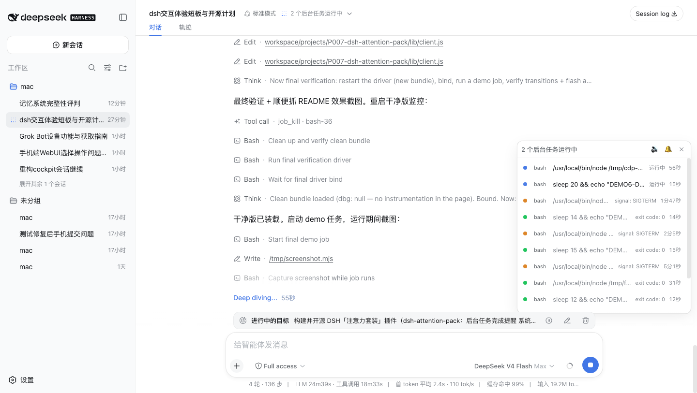
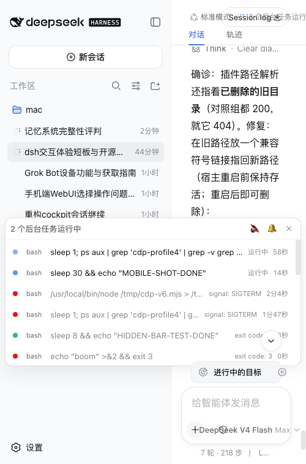

# dsh-attention-pack · 注意力套装

> 让 DeepSeek Harness 在后台任务干完的时候**叫你一声**——不用再盯着屏幕等外卖。

[](LICENSE)



---

## 它是干什么的

DSH 跑长任务（后台命令、工作流、子代理）的时候，界面上只有一个计时器在跳——任务什么时候干完、干成没有，全靠你时不时点开看。这个插件补齐「注意力管理」闭环：

1. **干完了叫你**：后台任务从运行 → 结束（完成 / 失败 / 取消）的那一刻：
   - ✅ **系统通知**（Web Notification，桌面浏览器）；
   - 🔔 **提示音**（Web Audio 双音：完成 = 轻快上行，失败 = 低沉下行）；
   - 📌 **标签页标题闪烁**（`✓ / ✗ 任务名`）。
2. **迷你任务条**：有任务运行时常驻输入框上方——状态点、类型、任务名、状态摘要、计时，一眼看清现在在跑什么；窄屏（手机）自动变通栏。
3. **随时开关**：声音、系统通知、收起状态条，各自独立按钮；设置存在本地浏览器，不联网、不上传任何数据。

**降级策略**：iOS Safari 网页不支持系统通知 → 自动降级为页面内行高亮闪烁；提示音需要你先在页面上点一下（浏览器自动播放策略），之后每次都响。

## 安装

本插件是 DSH 的 client 插件，装进你的 web profile：

```bash
# 1. 拿到插件（任选其一）
git clone https://github.com/<你的账号>/dsh-attention-pack.git
# 或直接拷 lib/ 与 package.json 到 ~/.dsh/profiles/web/node_modules/dsh-attention-pack/

# 2. 链接进 profile（替换成你的实际路径）
ln -s "$PWD/dsh-attention-pack" ~/.dsh/profiles/web/node_modules/dsh-attention-pack

# 3. 在 ~/.dsh/profiles/web/cordis.patch.yml 里加一行
```

`cordis.patch.yml` 追加：

```yaml
- insert:
    - id: attention-pack
      name: dsh-attention-pack
```

刷新 DSH 页面即生效。删掉上面那几行即卸载（提醒会停、状态条会消失，你的数据不受任何影响）。

## 怎么用

1. 给 agent 派一个长任务（比如让它跑个后台脚本）；
2. 任务运行期间，右下角出现状态条，计时走动；
3. 任务结束：标题闪烁 + 提示音 + 系统通知（第一次会弹浏览器权限询问，点允许）；
4. 状态条右上角：🔊 开关提示音，🔔 开关系统通知，✕ 收起状态条（提醒不关）。



设置存于 `localStorage`（键 `dsh-attention-pack:settings`），只在本浏览器生效。

## 📱 手机锁屏推送（v2）

页面提醒只在你**开着 DSH 网页**时生效。v2 加了一条**服务端推送**通道：任务完成/失败的那一刻，DSH 宿主直接推一条消息到你的手机——**页面关着、手机锁屏、电脑合盖，都能收到**。

**设备覆盖（v2 之后）**：

| 场景 | 页面内提醒（v1） | 锁屏推送（v2） |
|---|---|---|
| 电脑开着 DSH 页面 | ✅ | ✅（手机同时收） |
| 电脑页面关了 / 合盖 | ❌ | ✅ |
| iPhone 锁屏 | ❌（苹果限制网页通知） | ✅ 走 Bark |
| 安卓手机锁屏 | ❌ | ✅ 走 ntfy |

**支持的通道**（可同时配多个）：

- **Bark**（iOS）：App Store 免费装，打开即得一个 Key；
- **ntfy**（安卓 / iOS / 网页）：免费开源，公开服务器或自托管都行；
- 两个通道都支持自定义 `baseUrl`（自托管 ntfy / 本地测试）。

**配置（1 分钟）**：

```bash
# 1. 手机装好 Bark（iPhone）或 ntfy（安卓），记下 key / topic
# 2. 写配置文件：
cat > ~/.dsh/attention-pack.push.json <<'EOF'
{
  "channels": [
    { "type": "bark", "key": "你的BarkKey" },
    { "type": "ntfy", "topic": "dsh-attention" }
  ]
}
EOF
# 3. 重启 DSH 应用（服务端插件在启动时加载）
# 4. 随便跑一个后台任务验证——手机应该马上收到推送
```

- 成功 = ✅ 任务完成：任务名；失败（含非零退出码）= ❌ 任务失败：任务名 + 退出码；取消 = 已取消。
- 日志在 `~/.dsh/attention-pack.push.log`（可观测，不出错时也可删）。
- 删掉配置文件即关闭推送。模板见 `docs/attention-pack.push.example.json`。

## 已知限制（如实说）

- 任务只有状态摘要（`detail`），没有实时日志流——状态条显示「状态 + 计时」，不显示输出尾巴；
- **失败识别**：DSH 任务数据里非零退出码仍算 `completed`（退出码在 `detail` 里）——本插件会解析 `exit code: N`，非零按失败提醒（✗ 红闪），与 DSH 原生 `failed/killed` 一视同仁；
- 同一个会话开多个标签页，每个标签页都会提醒一次；页面开着时，浏览器提醒和手机推送会**同时**到（两套独立开关，习惯哪个关哪个）；
- 页面内提醒受浏览器能力限制（iOS Safari 网页不能发系统通知）——锁屏场景请用 v2 推送；
- 本插件只关心**后台任务**（jobs）；agent 单回合内的工具调用不提醒（那是轨迹时间线的领域）。

## 技术说明（给开发者）

- `lib/client.js`：全部实现，浏览器端，零构建（纯 JS + `React.createElement`），沿用 DSH client 插件模式（`window.__ModuleLoader__.load` + slot 注入 `conversation.session.header.actions`）；
- 数据源与官方后台任务下拉同源：`useSessions((s) => s.jobsBySession[sessionId])`；
- 完成检测 = 渲染间 diff：`seen` Map 记 id → 旧状态，仅「live → settled」转变才提醒，页面加载时已结束的任务不会误报；
- 音效用 Web Audio 合成，无音频文件；
- 测试：`node --check lib/client.js` + 带 stub 的 SSR 渲染测试（6/6 通过）。

## License

MIT

---

## ☕ 请我喝杯咖啡

如果这个插件帮你省下了盯着屏幕的时间，欢迎请我喝杯咖啡 ☕（微信/支付宝收款码准备中，上线后这里会有两张码）。

---

## English

**dsh-attention-pack** adds an attention loop to DeepSeek Harness: when a background job settles (completed / failed / cancelled), it pings you — system notification, a Web Audio chime, and a tab-title flash (`✓ / ✗ job label`). While jobs run, a compact status bar floats above the composer showing status dot, kind, label, detail and a ticking duration (full-width on narrow screens).

Install: link the plugin folder into `~/.dsh/profiles/web/node_modules/` and add one `insert` row to `cordis.patch.yml` (see above). Refresh the page — done. Uninstall by removing the row.

Privacy: everything runs locally in your browser; no network requests, no analytics.

Known limits: iOS Safari has no Web Notification API (falls back to in-page row highlight); the jobs wire model has no live output stream, so the bar shows status/detail, not log tails; one notification per open tab.

License: MIT.
